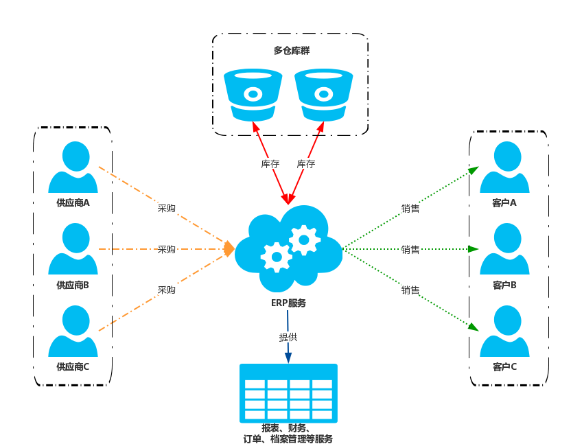

# ERP-介绍

ERP 系统是一个进销存系统，管理公司商品进销存方面的基础功能，为公司提供：采购、销售、库存、护理、档案管理等功能。如下图：

系统部署云端，主要提供一下功能简介如下：

- 系统

> 提供系统管理配置和档案管理方面的功能，如系统采购和销售流程配置，公司业务行业化配置等；提供了客户档案管理、供应商档案管理、生产企业档案管理、运输公司档案管理以及各种文件的统一档案管理功能。

- 商品

> 商品的信息维护和新增，商品的分类管理功能，商品价格配置功能，商品品牌管理，商品多规格配置管理以及商品多元化的自定义属性管理。

- 采购

> 采购订单：采购制单、审核、收货等功能
>
> 采购退货：采购退货申请、审核、质量审核、终审等功能

- 销售

> 销售订单：销售的制单、质审、终审等审批流程，销售订单列表和运输记录等功能。
>
> 销售退货：退货申请单、审核、退货收货、质检、终审等退货流程功能。

- 库存

> 入库：包含实时库存信息查询，入库收货、审核流程、仓库点设置等功能
>
> 出库：转库/耗损出库、审核等出库流程和明细查询功能。

- 营销

> 主要针对的是销售渠道端的一些配置信息，比如广告和公告的配置。

- 财务

> 根据采购和销售过程中，生成对应的财务流水，也提供预收款预付款登记和重新等功能，能根据财务流程，查询到每一笔明细的关联流水信息。

- 权限

> 提供不同员工，可见页面菜单权限配置，以及员工状态和建立员工账户的功能，也配置了系统一些常用角色的配置，如采购员和销售员的配置功能。

- 报表

> 提供各种报表，提供商品溯源信息等报表功能。
