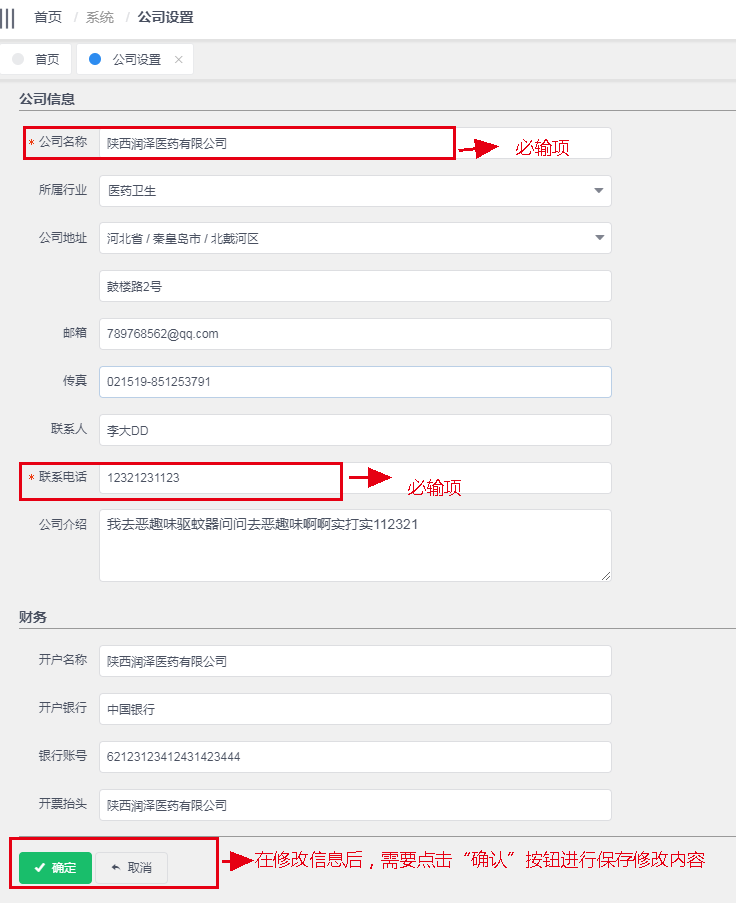

## 公司设置

---

> 维护1公司的基础信息和财务开票信息等。通过 **系统->公司设置** 进入公司信息配置页面。

公司设置页面中，主要是设置用户公司的一些基本的信息，包含 _公司名称_ 、 _所属行业_ 、 _公司地址_ 、 _联系人电话_ 等信息。

另外，也包含了公司让供应商开票时使用的发票抬头信息，财务流水中记录使用的默认银行清算账号等信息。

“公司名称”和“联系电话”是这个页面信息维护时必输项，“联系电话”在保留是使用于系统的一些通知信息等。

“所属行业” 这一属性定义了公司所属的行业信息，在 APP 或者渠道端可以用于区分公司行业，方便客户根据行业信息，搜索到公司在销售渠道上的主要信息。

公司介绍、地址、联系方式，会在销售渠道 APP 公司商铺主页中会有写公司的介绍信息展示和联系方式显示。

页面详情信息如下:

