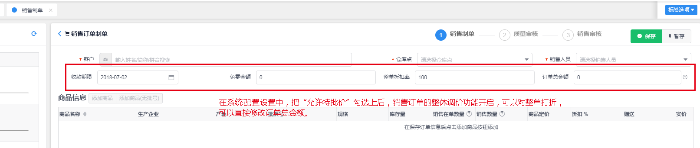

## 系统配置

<!-- toc -->

---

> 系统功能的一些配置信息，比如公司的业务类型配置，采购销售审批流程配置，销售制单时是否允许进行整单调整价格的配置等。

### 公司业务类型

---

公司业务类型配置信息，目前设定有两种情况，一种为 **药品经营类**，一种为 **其他**。

药品配置信息，主要是表示公司的主要营业类型信息，控制商品中的一些特殊数据。例如：如果配置中选择了 **药品经营类**，则在商品配置信息中，会多出一个 **药品特殊配置信息**，可以标识商品是否为 **特殊监管类药品** 和 **冷链标识**。

> **特殊监管类药品**
>
> 在勾选上后，采购和销售制单过程中，需要验证对应供应商或者客户是否有对应的资质(即供应商或客户也需要勾选了能经营特殊管理药品的标识)，并且，在收货时，需要按双人收货的规则在收货人中输入双人姓名，在质量验收流程中，也需要输入验收人的双人姓名，这些规则是又国家药品监管规定的。

> **冷链经营**
>
> 在勾选上后，同样在采购和销售过程中需要验证客户和供应商的资质，并且需要登记 **运输方式** 和 **收货温度** 这些条件。

配置页面信息如下：

公司类型勾选了 **药品经营类** 时，在商品详情页和采购销售制单流程中，对多出以下一些配置：

- **商品列表->商品信息维护**

- **采购->采购制单**

- **采购->采购收货(库存->录制入库单)**

- **销售->销售制单**

### 销售特批价调整

---

> 在制作销售单时，控制是否允许在制单过程中进行整单打折和调整订单的总价格。

配置入口和配置页面信息如下：

- **销售->销售制单**

