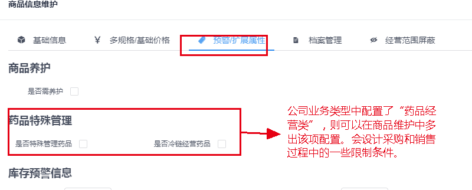
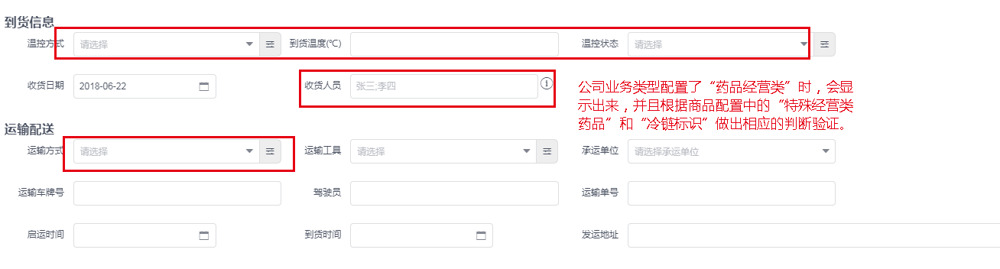

## 系统配置

<!-- toc -->

---

> 系统功能的一些配置信息，比如公司的业务类型配置，采购销售审批流程配置，销售制单时是否允许进行整单调整价格的配置等。

### 公司业务类型

---

公司业务类型配置信息，目前设定有两种情况，一种为 **药品经营类**，一种为 **其他**。

药品配置信息，主要是表示公司的主要营业类型信息，控制商品中的一些特殊数据。例如：如果配置中选择了 **药品经营类**，则在商品配置信息中，会多出一个 **药品特殊配置信息**，可以标识商品是否为 **特殊监管类药品** 和 **冷链标识**。

> **特殊监管类药品**
>
> 在勾选上后，采购和销售制单过程中，需要验证对应供应商或者客户是否有对应的资质(即供应商或客户也需要勾选了能经营特殊管理药品的标识)，并且，在收货时，需要按双人收货的规则在收货人中输入双人姓名，在质量验收流程中，也需要输入验收人的双人姓名，这些规则是又国家药品监管规定的。

> **冷链经营**
>
> 在勾选上后，同样在采购和销售过程中需要验证客户和供应商的资质，并且需要登记 **运输方式** 和 **收货温度** 这些条件。

配置页面信息如下：

公司类型勾选了 **药品经营类** 时，在商品详情页和采购销售制单流程中，对多出以下一些配置：

- **商品列表->商品信息维护**

- **采购->采购制单**

- **采购->采购收货(库存->录制入库单)**

- **销售->销售制单**

### 销售特批价调整

---

> 在制作销售单时，控制是否允许在制单过程中进行整单打折和调整订单的总价格。

配置入口和配置页面信息如下：

- **销售->销售制单**

### 订单流程设置

---

> 针对不同的业务特征，设置对应的业务流程，提高公司的效率。目前主要可配置的流程有四个：**采购流程**、**采购退回流程**、**销售流程**、**销售退回流程**。配置信息如下图：

**入口**

**配置详情**

> **操作提示**
>
> 圆点中是实心圆点的流程不中代表必要的流程节点，不能去除该阶段的流程。
> 在有打钩的圆圈或文字上点击，会把当前流程关闭，关闭后流程会直接跳过这一步骤节点；
> 在红色减号的圆圈或文字上点击，会把当前流程打开，打开后流程是需要经过该步骤节点才能到下一笔流程节点中。
> 在修改完成流程节点后 **必须点击下面的保存按钮，才会保存修改的流程步骤配置，同事，需要在使用的页面中，刷新对应页面才能显示出配置后的流程信息**。

#### 采购流程

> 采购流程是针对采购订单的流程走向。主要涉及的流程节点有：
> **采购制单**、**采购单审核**、**采购收货**、**入库质量验收**、**入库终审**。每个功能的具体入口如下:

- 采购制单：_采购->采购制单_, 必要过程。
- 采购单审核：_采购->采购单审核_, 非必要过程。
- 采购收货：_采购->采购收货_ (或者 _库存->录制入库单_), 非必要过程。
- 入库质量验收：_库存->入库质量验收_, 非必要过程。
- 入库终审：_库存->入库审核_, 非必要过程。

> **提醒**
>
> 采购收货后，如果配置的流程中，没有 **入库质量验收** 和 **入库终审** 这两个步 骤，在采购收货后会直接入库，并且生成采购财务流水。
>
> 入库质量验收后，如果配置的流程中，没有 **入库终审** 这个步骤，则会在入库质量验收后直接入库，并且生成采购财务流水。
>
> 没有的配置上的流程，会直接跳过该步骤的操作，直接进入下一步操作流程中。

#### 采购退回流程

> 采购退回流程是针对采购订单在审核完成入库后，做退出退货的操作流程。至针对已经入库的采购单。主要涉及的流程节点有：
> **退回单申请**、**退回单审核(采购经理审核)**、**退回单审核(质管经理审核)**、**退回质量审核**、**退回终审**。每个功能的具体入口点如下：

- 退回单申请：_采购->采购退出申请_，必要过程。
- 退回单审核(采购经理审核)：_采购->采购退出申请审核_，非必要过程。
- 退回单审核(质管经理审核)：_采购->采购退出申请审核_，非必要过程。
- 退回质量审核：_采购->采购退出质量审核_，非必要过程。
- 退回终审：_采购->采购退出终审_，必要过程。

> **提醒**
>
> 在 **退回终审** 审核通过后，会直接修改库存数量，并且会生成对应的采购退回财务流水。

#### 销售流程

> 销售流程主要是针对销售订单的流程，在销售终审后通过后，会减去库存数量，并且生成对应的销售财务流水。主要涉及的流程节点有：
> **销售制单**、**出库质量审核**、**销售终审**。每个功能的具体入口点如下：

- 销售制单：_销售->销售制单_，必要过程；
- 出库质量审核：_销售->销售出库质量审核_，非必要过程；
- 销售终审：_销售->销售终审_，必要过程。

> **提醒**
>
> **出库质量审核** 这个流程节点可以去除，制单后直接进入到终审流程。**销售终审** 通过后，会修改库存数量，并且会生成对应的销售财务流水。

#### 销售退回流程

> 销售退回流程主要针对的是销售订单在修改库存数量后，也就是销售出去之后，客户进行退回的操作流程。主要涉及的流程节点有：
> **退回单申请**、**退回单审核(销售经理审核)**、**退回单审核(质管经理审核)**、**退回收货**、**退回质量审核**、**退回终审**。每个功能的具体入口地址如下：

- 退回申请：_销售->销售退单申请_，必要过程；
- 退回单审核(销售经理审核): _销售->销售退单申请审核_，非必要过程；
- 退回单审核(质管经理审核)：_销售->销售退单申请审核_，非必要过程；
- 销售退单收货：_销售->销售退单收货_，必要过程；
- 销售退单质量复核：_销售->销售退单质量复核_，非必要过程；
- 退回终审：_销售->销售退单终审_, 非必要过程。

> **提醒**
>
> **退回单审核(销售经理审核)**、**退回单审核(质管经理审核)** 这两个流程节点，是在同一个菜单项中，又两个不同的操作员进行操作，之间是有前后顺序的，前后顺序就是流程配置图中的先后顺序。
>
> **退回收货** 之后的流程节点中，如果已经没有配置有流程节点，那么会在收货后直接进入到最终状态，并且修改库存数量，同时生产销售退货财务流水。
