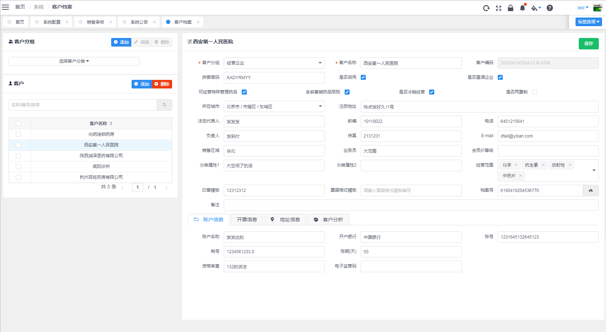
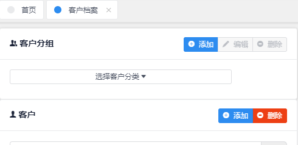
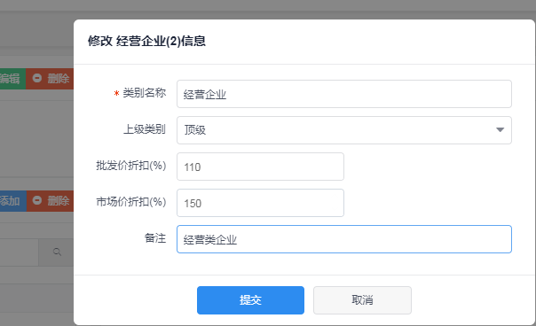
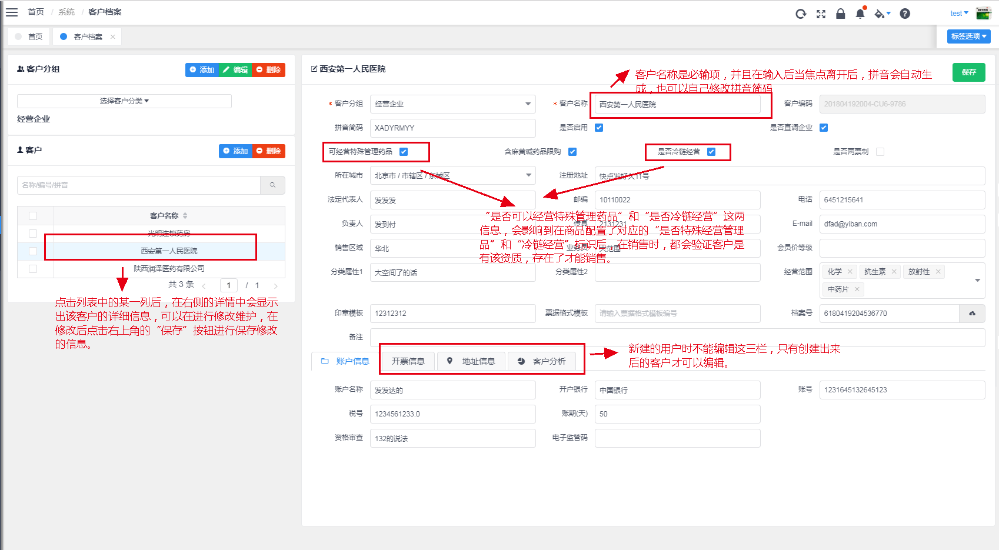
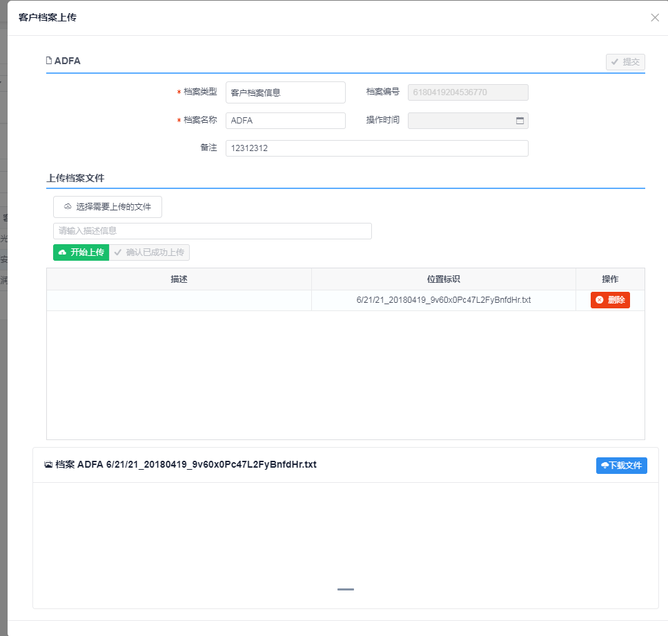
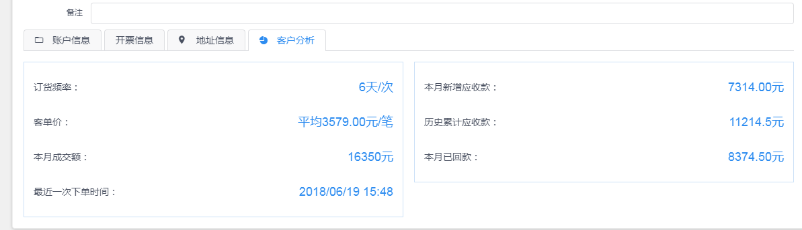

## 客户档案

---

菜单入口：_系统->客户档案_。客户信息作为销售的主要对象，维护了公司客户信息管理和档案管理功能，以及客户的活跃度和当前财务应收应付账款等统计信息。

页面的主要内容如下：

### 客户分组

---

客户分组主要的作用是对客户进行划分不同归属组的功能，一个客户只能在一个客户分组中，不能跨多个分组。

在 **客户档案** 页面的左上角区域，可以维护客户分组的信息，如下图：

**选择客户分类** 的下拉框中以树形结构显示了客户分组的层次结构，同时，在该下拉框中，当选择某一类型，则“客户分组”下面的“客户列表”中会同步更新为只显示选中的分组的客户列表信息。

另外, 选择了客户分组后，客户分组模块中的 **编辑** 和 **删除** 按钮处于可编辑状态，点击 **编辑** 按钮，会弹出“客户分组”修改编辑框，客户修改对应的分组信息。如下图：

**类型名称** 为必输项，**上级类别** 是表明当前分组归属在那个分组下的，也可以直接归属到顶级分组上。

> **批发价折扣** / **市场价折扣**
>
> 批发价折扣率和市场价折扣率，以百分比作为基数，如在输入框中输入 90，则代表则 90%，即 9 折的意思。
>
> **注意:**
>
> 批发价折扣和市场价折扣，是在配置商品的价格信息时，如果按客户类型来配置客户组下的指定价格，该折扣率是默认带上的折扣率，需要经过价格配置中的计算，才能实现商品价格调整。商品的实际价格还是需要在商品价格中配置，在客户分组中维护的折扣率只是一种基础基数，是用于配置商品价格的默认基数，不会影响客户销售的商品价格。如果需要不同的客户分组中存在有不同的商品价格，还是需要在商品价格配置中实现配置，具体信息看 **[商品价格](../goods/goods_price.md)**。

**添加客户分组**

点击客户分组模块中的 **添加** 按钮，会弹出“新建客户分组”的窗口，输入对应的信息后，点击 **提交** 按钮，会把数据提交到后台，进行保存，保存成功后客户分组则新建成功。

**删除客户分组**

点击客户分组模块中的 **删除** 按钮，会直接请求后台服务，进行删除“客户分类”下拉框中选择的客户分组，但是：**如果某一个客户分组下存在有客户信息，则不能删除该客户分组**。

### 客户信息维护

---

在客户分组模块下面，是“客户列表”模块，是以列表的形式显示出客户的信息，列表查询的条件可以有：客户分组模块中选择的客户分组，列表上方的输入框中可以根据 _客户名称、客户编号、拼音_ 其中的一个添加进行模糊匹配列表值。

**添加客户功能**

客户列表模块中，点击 **添加** 按钮，则页面右侧的客户详情中会初始化客户表单信息，可以输入客户的信息，输入完整后，点击右上角的 **提交按钮** 则会把客户信息提交到后台进行保存，

> 客户详情下方的 **开票信息**、**地址信息**、**客户分析** 这三个菜单项，只有在客户建立出来后才能编辑和查看。

**删除客户功能**

在客户列表模块中，可以勾选列表中需要删除的用户信息，然后点击 **删除** 按钮，删除选中的客户信息，**注意：客户信息删除后，不可恢复, 删除操作请慎重考虑**。

**客户信息维护**

在客户列表模块中，点击列表中的某一个客户，则会在右侧的详情中显示出该客户的详细信息，如下图：

客户信息维护中，“客户分组”和“客户名称”是必输项，“客户编码”是由系统自动生成的；“拼音简码”在客户名称输入后，会根据输入的客户名称自动识别出对应的拼音简码，用户也可以自己进行输入修改。

> **注意**
>
> **可经营特殊管理药品** 和 **是否冷链经营** 这两个选择项，会涉及到客户是否能购买一些配置有“特殊管理药品”和“冷链经营”标识的商品。如果商品中配置了对应资质，客户没有对应该资质，则销售制单时，该客户不能添加有特殊管理资质的药品。

**档案号**

在客户信息的“档案号”输入框中，可以客户点击输入框后面的上传按钮，然后可以在弹出框中维护和上传一些客户的档案信息，**注意：档案号是有上传文件后自动生产的系统档案编号，不能由自己定义**, 如下图上传档案信息：

**账户信息**

账户信息主要是维护客户的银行信息，用于在财务流水中使用的默认结算账户和银行账号。

**开票信息**

主要是维护客户销售订单中，主要涉及到的开票信息，比如开票抬头和发票类型以及税率等。

**地址信息**

地址信息主要是维护客户的收货地址和收货人信息，客户配置多个，也可以对原有的进行修改，并且禁用和启用，还可以设置默认使用的客户地址信息，在制作销售单时默认选择。

**客户分析**

主要是对客户的销售和交易额信息进行统计分析，表现客户的活跃度信息等，如下图统计信息：

