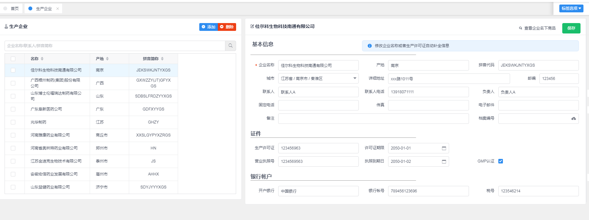

## 生产企业

---

> 菜单入口：_系统->生产企业_, 主要是配置商品的生产企业档案信息的维护。

页面主要内容如下：

生产企业档案维护页面主要分两个区域， **生产企业列表区** 和 **生产企业详情区**。

点击“列表区”上方的“添加”按钮，可以重置详情区内容，然后可以根据生产企业信息，输入新的生产企业内容，输入完成后点击详情区的“保存”按钮，可以保存创建新的生产企业档案信息。

> 提示:
>
> 在详情区中输入 **企业名称**, 系统会根据药品生产企业的联网内容，自动补充一些这个生产企业的内容。

在列表区中勾选对应的生产企业，点击“删除”按钮，可以删除勾选中的生产企业信息，**注意：删除后不可恢复，并且已经使用的生产企业是不可以删除的。**

点击列表区中的列表中的某一条记录，会在详情区中显示出该生产企业的详情内容，可以修改后点击保存按钮来修改生产企业的信息。
