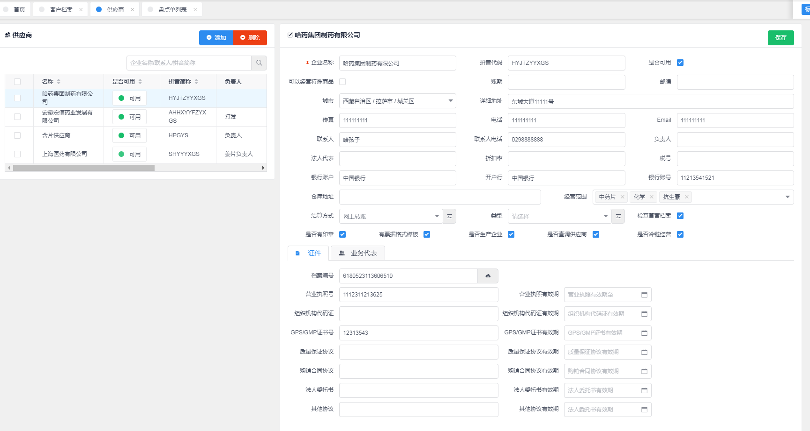
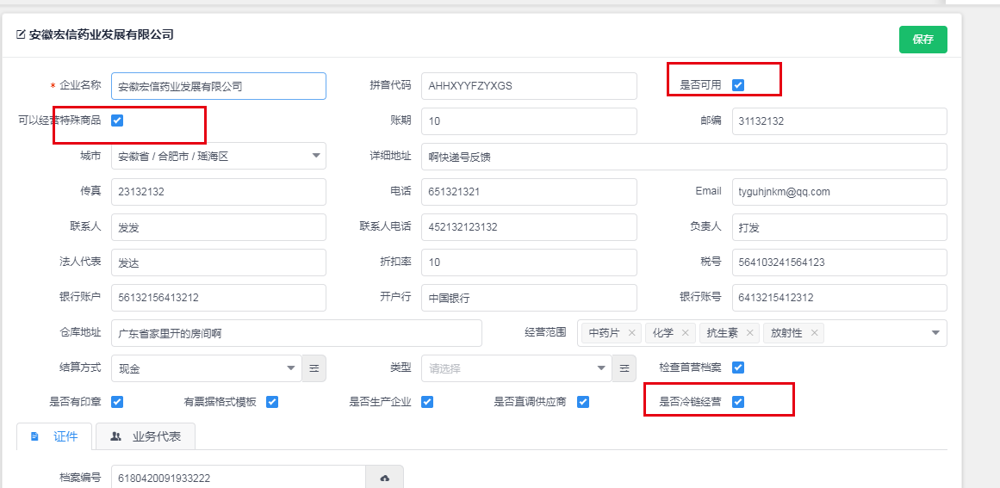
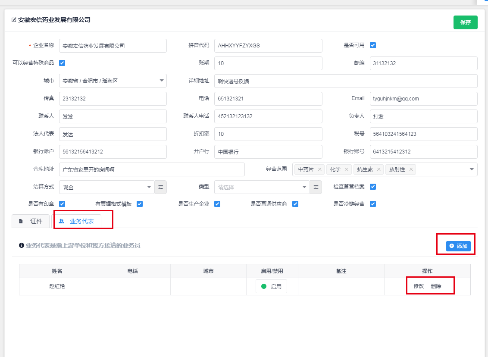

## 供应商

---

> 入口菜单：_系统->供应商_， 供应商作为采购的上游货源提供商，维护了公司供应商的基础信息维护和查看功能，以及采购财务流水的主要客户之一。

页面主要内容如下图：

左侧为供应商列表区，可以点击列表中的一个，然后在右侧的详情中显示出该供应商的具体信息。可以修改并且保存。

点击列表区的“添加”按钮，会重置右侧详情区的内容，然后可以输入新供应商的详细信息，输入完成后点击详情区的右上角的“提交”按钮，可以创建出一个新的供应商信息。

在列表区的供应商列表中，可以勾选商供应商，然后点击列表区上方的“删除”按钮，然后可以删除勾选中的供应商信息。

> 注意点：
>
> **是否可用** 属性标识这个供应商是否能再使用，如果是不可用，那么在选择供应商的下拉列表中，会把该供应商排除。
>
> **可以经营特殊商品** 标识是关于药品特殊管理的商品，也就是说，当一个商品配置有“特殊管理药品”标识时，采购时，供应商也必须有这个“可以经营特殊管理商品”的标识，否则不可采购这类型的商品。
>
> **是否冷链经营** 标识也是会影响采购时的判断逻辑。如果采购的商品中存在有“冷链经营”标识，那么供应商也需要有该标识，并且，采购单中的运输方式和温控方式时必输信息。
>
> 修改供应商信息时，需要点击右上角的“保存”按钮，才能把修改休息保存。

### 供应商代表

---

供应商代表是在供应商创建出来后才能进行维护信息，也就是说需要先有供应商。可以通过点击供应商详情区域中的业务代表区的“添加”按钮来添加供应商信息。在供应商代表列表中可以“修改”和“删除”供应商代表信息。如下图：

